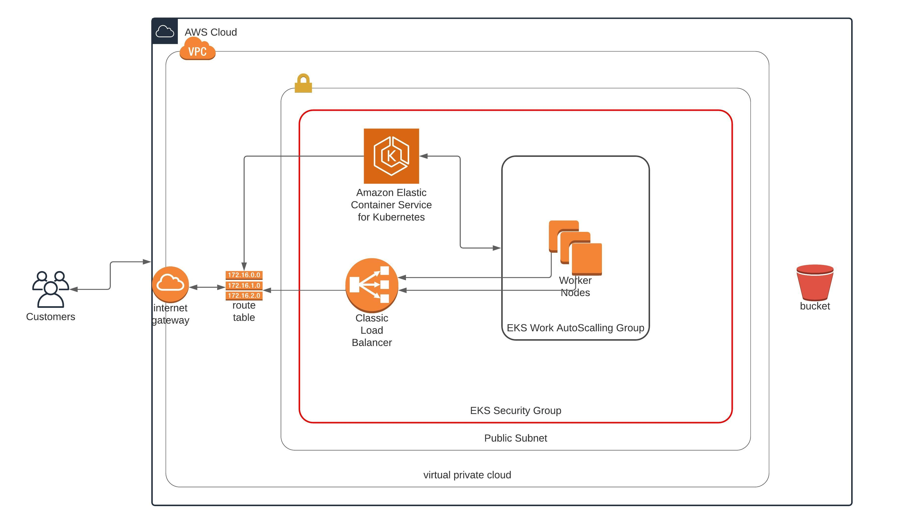

## Infrastructure Overview

The application is deployed to AWS.



For simplicity, I'm putting the worker nodes on the same public subnets as the control plane, but ideally, the workers should be on a private subnet interacting with control plane within the same vpc.

### Deploying the EKS Cluster

Deploy the EKS Cluster using cloudformation. Scripts:

```
# deploy vpc and subnets
./stack-create.sh TxMgmtEksNetwork cloudformation/networks.yml file://cloudformation/parameters/networks.json

# deploy eks cluster and control plane
./stack-create.sh TxMgmtEksCluster cloudformation/cluster.yml file://cloudformation/parameters/cluster.json

# deploy worker nodes
./stack-create.sh TxMgmtEksWorkers cloudformation/eks-nodegroup.yml file://cloudformation/parameters/eks-nodegroup.json
```


Now, your EKS cluster and workers are running.

You can configure as needed using the files in the `cloudformation/paramters/` directory

### Configuring Kubectl and Deploying Cluster

```
export CLUSTER_NAME=TxMgmtEksCluster
aws eks --region us-west-2 update-kubeconfig --name $CLUSTER_NAME
```

Next, deploy config map to EKS with appropriate worker instance role to locate and manage instances:

```
sed -e 's+{{ .InstanceRoleArn }}+<instance-role-arn>+g' kubernetes/aws-auth-cm.yml | kubectl apply -f -
```
<!-- 
```
sed -e 's+{{ .InstanceRoleArn }}+arn:aws:iam::394872240698:role/TxMgmtEksWorkers-NodeInstanceRole-16FIWTAPD2MIA+g' kubernetes/aws-auth-cm.yml | kubectl apply -f -
```
-->

Get `<instance-role-arn>`'s value from output of Cloudformation for node groups.


### Deploying Backend Code

NOTE: Ensure a postgresql database is available and the URL is ready to be exported securly as a secret to kubernetes

First build an image of the backend code
```
 docker build -t perfectmak/txmgmt:<new-version> .
```

Next, push it up
```
docker push perfectmak/txmgmt:<new-version>
```

```
sed -e 's/{{ .DeploymentId }}/<new-version>/g' kubernetes/backend-deployment.yml | kubectl apply -f -
```

NOTE: `<new-version>` should be the hash of the new backend container to be used.

Verify that the deployment and services are deployed successfully.

Get service hostname with:
```
export API_URL=http://$(kubectl get service/service-bbbd31618f2f5a1329b9b466a9fc1d71c3b1a8fd --output=jsonpath='{.status.loadBalancer.ingress[0].hostname}')
```

Remember to cleanup the previous deployments

### Deploying Frontend Code

